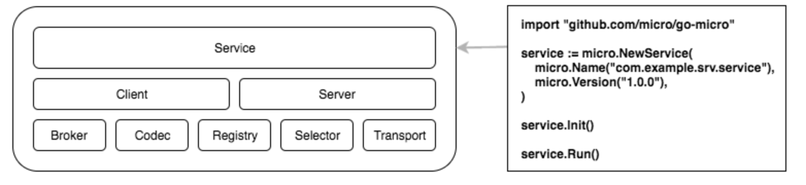

### GO-MICRO架构图（三层设计，5大模块组成）

    

1，最上层的service是基于Go-Micro所构建的服务，属于应用层。
2，中层的Client与Server是第一层中service所包含的服务请求端与服务响应端，它们存在于service中，处于设计中的中游，是Go-Micro体系中一切请求与响应的出入口
3，最下层的便是Go-Micro核心5模块所在，broker负责消息代理/订阅，Codec负责编码，Registry负责注册发现，Selector负责负载均衡，Transport指定数据传输协议（负责服务与服务之间请求与响应）

Registry
注册表提供可插入的服务发现库，来查找正在运行的服务。当前的实现是consul，etcd，内存和kubernetes。如果您的喜欢不一样，该界面很容易实现。

Selector
选择器通过选择提供负载均衡机制。当客户端向服务器发出请求时，它将首先查询服务的注册表。这通常会返回一个表示服务的正在运行的节点列表。选择器将选择这些节点中的一个用于查询。多次调用选择器将允许使用平衡算法。目前的方法是循环法，随机哈希和黑名单。

Broker
Broker是发布和订阅的可插入接口。微服务是一个事件驱动的架构，发布和订阅事件应该是一流的公民。目前的实现包括nats，rabbitmq和http（用于开发）。

Transport
传输是通过点对点传输消息的可插拔接口。目前的实现是http，rabbitmq和nats。通过提供这种抽象，运输可以无缝地换出。

Client
客户端提供了一种制作RPC查询的方法。它结合了注册表，选择器，代理和传输。它还提供重试，超时，使用上下文等。

Server
服务器是构建正在运行的微服务的接口。它提供了一种提供RPC请求的方法。
